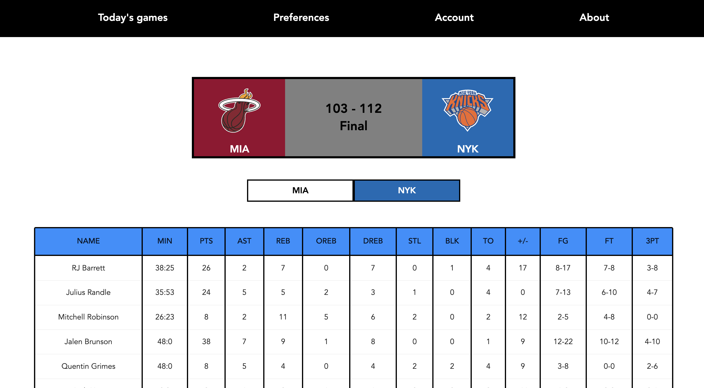
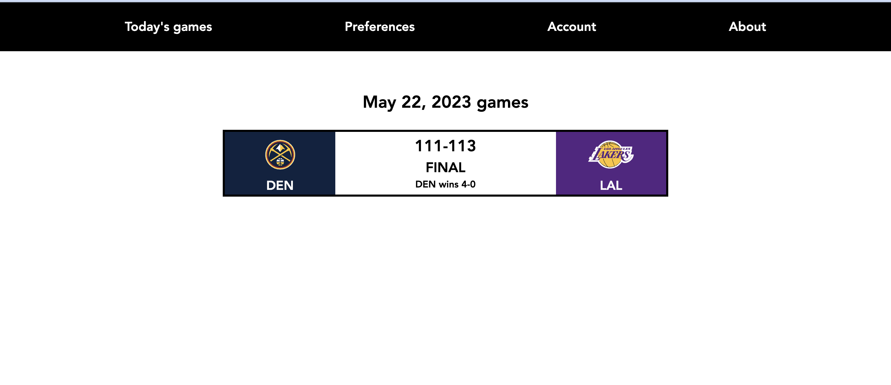

## Custom Boxscores

- Web app is still under development because my old Mac abruptly stopped working and I nearly finished this project on previous laptop (but did not back the repo up in time). Please check back in a couple days for an update (Final website URL will be attached here)
- The exhaustive list of python libraries used to build the project API is listed in server/requirements.txt.

### Stack 
- Backend - FastAPI (Python framework), NBA API, Google OAuth2 
- Frontend - React (JavaScript framework)
- Database - Mongo DB
- Deployment - AWS

### Progress

- The following images display the landing page and game details page on clicking a certain game card container. The UI is continually being refined. 

